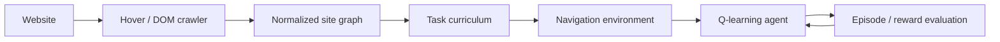

# Web Navigation RL Prototype

A hackathon prototype that turns a real website into a small reinforcement-learning environment: crawl the site, normalize its navigable structure, build a task curriculum, and train an agent to choose navigation actions that reach target pages efficiently.

> **Project status:** completed hackathon/research prototype. The interesting work is primarily in environment construction, state/action design, curriculum generation, and reward shaping. The learning algorithm is intentionally simple (tabular Q-learning), so this should not be read as a claim of state-of-the-art RL.

## System overview



The project treats browser navigation as a sequential decision problem rather than a one-shot link-ranking task. A state captures where the agent currently is and what navigation options are available; actions correspond to navigable elements; rewards encode progress toward task targets and discourage unnecessary or invalid navigation.

## Reviewer guide

| File | What to inspect |
| --- | --- |
| [`hover_crawler.py`](hover_crawler.py) | crawling and extraction of interactive/navigation structure |
| [`curriculum_builder.py`](curriculum_builder.py) | conversion of crawled structure into training tasks |
| [`new_rl_agent.py`](new_rl_agent.py) | latest environment/agent/training path |
| [`rl_agent.py`](rl_agent.py) | earlier training implementation and iteration history |
| [`base.py`](base.py) | shared crawler/environment utilities |
| [`crawl_result.json`](crawl_result.json) | retained example crawl artifact |
| [`curriculum_tailored.json`](curriculum_tailored.json) | retained example task curriculum |
| [`reward_curve.png`](reward_curve.png) | example training artifact |

The strongest engineering signal here is the translation from messy browser/DOM behavior into a tractable environment, not the complexity of the Q-learning update itself.

## Pipeline

### 1. Crawl and normalize

`hover_crawler.py` explores the target site and records pages and navigable interactions. A local mirror/example crawl is retained in the repository so the later stages can be inspected without relying entirely on a live site.

### 2. Build a curriculum

`curriculum_builder.py` derives navigation tasks from the observed structure. This separates **what the agent is asked to reach** from the mechanics of the environment and makes it possible to train/evaluate across multiple task difficulties.

### 3. Train an agent

The RL implementation uses a discrete/tabular value function. During an episode the agent chooses among available navigation actions, receives shaped rewards, and updates its Q-values. Exploration/exploitation and curriculum difficulty can be varied without changing the crawler.

### 4. Evaluate

The retained plots and JSON artifacts were used during the hackathon to inspect training behavior and task success. They are example outputs, not a formal benchmark suite.

## Setup

```bash
python -m venv .venv
# Windows: .venv\Scripts\activate
# Unix/macOS: source .venv/bin/activate
pip install -r requirements.txt
```

The crawler path may require a compatible browser/WebDriver and access to the target site. For reviewing the RL/environment code, the checked-in crawl and curriculum artifacts allow much of the pipeline to be understood without recrawling.

## Repository structure

```text
hover_crawler.py          website/interaction crawler
curriculum_builder.py     training-task generation
new_rl_agent.py           latest agent/environment implementation
rl_agent.py               earlier implementation
base.py                   shared utilities
site_mirror/              retained crawl/mirror material
crawl_result.json         example crawl output
curriculum_tailored.json  example curriculum
reward_curve.png          example training output
```

## Limitations

- **Algorithmic ceiling:** tabular Q-learning does not scale to rich continuous browser states or large action spaces.
- **Environment brittleness:** DOM structure and interactive elements change over time; a live website is not a stationary benchmark.
- **Reward design:** shaped navigation rewards can encode unintended shortcuts, so apparent learning should not be interpreted independently of the reward definition.
- **Evaluation:** the repository does not contain a large, frozen held-out benchmark establishing generalization to unseen sites.
- **Artifacts:** crawl/result files are retained as reproducibility/debug examples rather than generated-package assets.

## What I would change now

I would keep the crawler/environment boundary but replace the tabular state representation with learned or structured page/action features, freeze a multi-site benchmark with deterministic fixtures, and report success/path-efficiency against non-RL baselines such as shortest-path search, heuristic link ranking, and a policy trained without curriculum shaping. I would also add tests around state transitions and reward invariants before increasing agent complexity.
